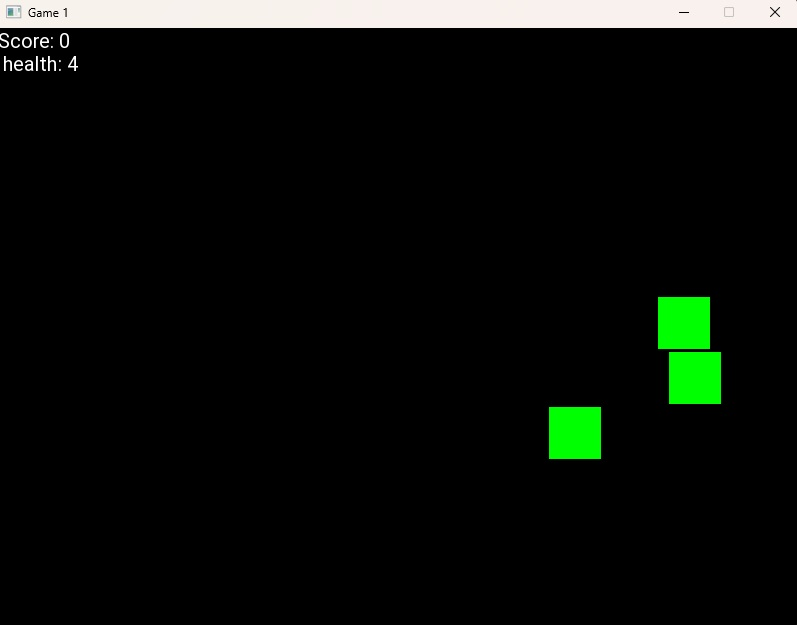
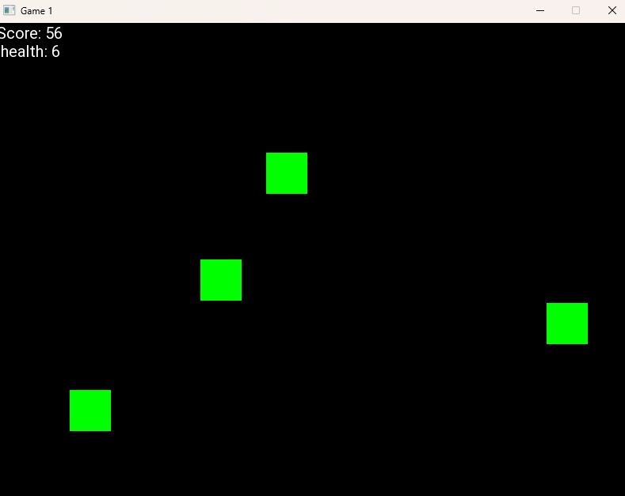
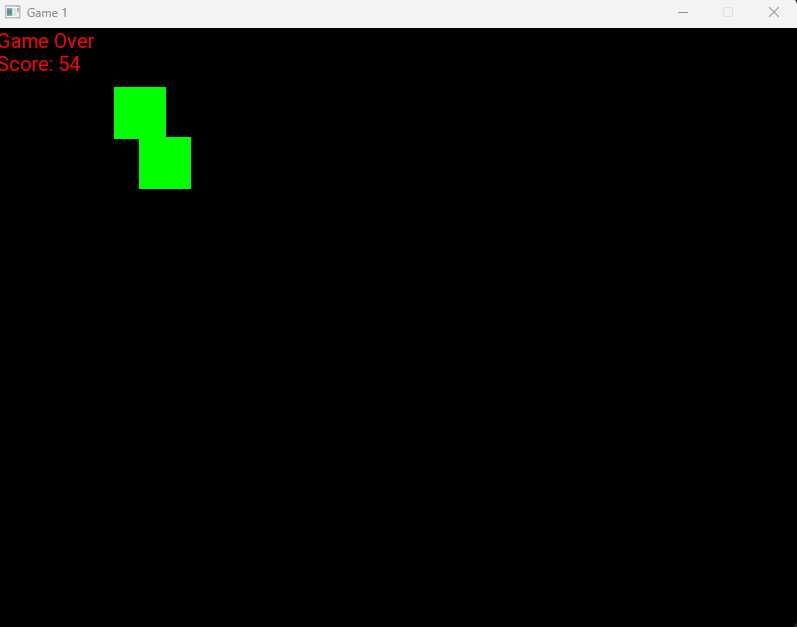

# Click Falling Triangles Game



## 📜 About

**Falling Triangles Game** is an interactive  game built with C++ and [SFML](https://www.sfml-dev.org/). In this game, players must click on green triangles that fall from the top of the screen. Each triangle clicked successfully gives the player a score of +1. The game increases in difficulty every time the score reaches a multiple of 50 by increasing the spawn rate of triangles. Players start with a set amount of health, and the game ends if the player's health reaches 0.

This project is open-source and intended as a fun way to learn about game development in SFML.

## 🎮 Gameplay Features

- **Triangle Enemies**: Green triangles fall from the top of the screen.
- **Point-and-Click**: Use the mouse to click on each triangle to score points.
- **Scoring System**: Earn +1 score for each triangle clicked. The current score is displayed in the top-left corner.
- **Health System**: Start with a set amount of health; each missed triangle decreases health. When health reaches 0, the game ends.
- **Progressive Difficulty**: Every 50 points, the game spawns triangles at an increased rate, making it more challenging.
  


## 📈 Score & Health Mechanics

- **Score Display**: The score is visible at the top-left corner.
- **Health Display**: The remaining health is shown next to the score in the top-left corner.
- **Game Over Condition**: If health reaches 0, the game will end, and a "Game Over" message will appear.

## 🕹️ How to Play

1. Launch the game and wait for the triangles to start falling.
2. Use your mouse to click on each triangle to score points.
3. Monitor your health and score in the top-left corner.
4. Try to reach higher scores while managing the increasing difficulty level!

## 💻 Getting Started

### Prerequisites

Make sure you have the following installed:

- **C++ Compiler**: Ensure you have a compatible C++ compiler installed (GCC, MSVC, or Clang recommended).
- **Visual Studio**: Ensure you have a compatible Visual Studio version for SFML (Visual Studio 2022).

### Installation

1. Clone the repository:
   ```bash
   git clone https://github.com/TheMaysTRol/SFML-Click-To-Score-game.git
   cd SFML-Click-To-Score-game
2. Open project with visual studio.
3. Run the game.

## 📷 Screenshots

### Main Game Screen


### Game Over Screen


